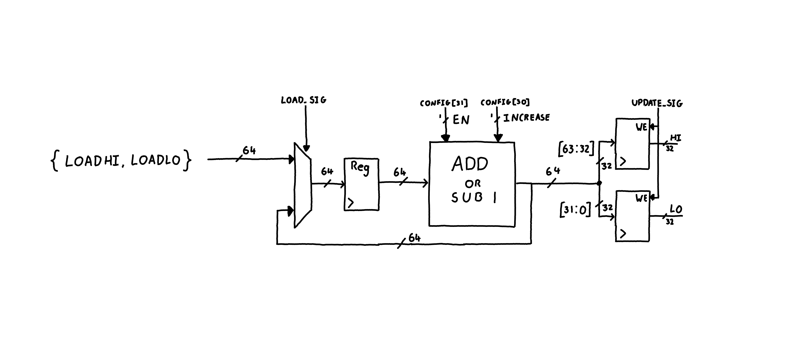
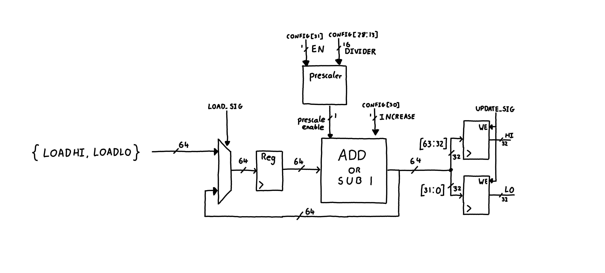

# EmSys Lab 5: ESP32 Timer and Verilog Timer 

In this lab you will write some code that will interact with some of the ESP32 hardware timer peripherals. You will then describe a hardware timer in Verilog and simulate it. You must complete the following tasks for this lab:

* [__Task 1__] configure one of the hardware timer peripherals on the ESP32 device.
* [__Task 2__] construct the hardware and MMIO interface for one of the ESP32 hardware timers in Verilog.

## Task 1: Configuring an ESP32 hardware timer

In your GitHub logbook repository you should have the following directory: ``lab5/task1/task1.ino``. In this folder there is a partially completed sketch for your __TinyPico__ device for configuring a hardware timer module.

You will have to complete three functions, ``setupTimer``, ``resetTimer``, and ``readTimer`` to complete this task. In each of these functions you will use the hardware memory-mapped registers at the top of the file to configure the bits of the timer and complete the functions.

The only thing that you need to commit to your logbook for this task is the completed sketch ``lab5/task1/task1.ino``.

__For information on how the hardware timer module operates please watch the following mini lecture [[here]()].__ 

For this task you will be configuring the hardware timer module 0 in timer group 0. Information on these timers can be found the ESP32 [[Technical Reference Manual](https://www.espressif.com/sites/default/files/documentation/esp32_technical_reference_manual_en.pdf)] page 498. In the technical reference manual (TRM) there is details on the operation of the timer and of the individual registers that you need to read and write to in order to configure it. For the timer that we will be configuring in this lab the table below details the registers that you will need to interact with. For each register, a TRM reference is given, this is the reference that you can use to look up more details of that register in the technical reference manual.

|   Register   |     Name   |    TRM reference  |   Info |
|--------------|------------|-------------------|--------|
| 0x3FF5F000   |   CONFIG   |    18.1           | Used to configure the timer | 
| 0x3FF5F004   |   LO   |    18.2           | Bottom 32-bits of the timer value | 
| 0x3FF5F008   |   HI   |    18.3           | Top 32-bits of the timer value | 
| 0x3FF5F00C   |   UPDATE   |    18.4           | __Any__ write to this register stores the current timer value in HI and LO | 
| 0x3FF5F018  |   LOADLO   |    18.7           | Value to load onto the bottom 32 bits of the counter | 
| 0x3FF5F01C  |   LOADHI   |    18.8           | Value to load onto the top 32 bits of the counter | 
| 0x3FF5F020  |   LOAD   |    18.9           | __Any__ write to this triggers LOADLO and LOADHI to be written into the counter | 

---------------------------------------------------------------------------------

### Step 1: ``setupTimer``

The ``setupTimer`` function performs the following tasks:
* Enables the timer by setting the EN bit of the CONFIG register.
* Sets the timer to increase it's count by setting the INCREASE bit of the CONFIG register.
* Sets the DIVIDER bits of the CONFIG register to configure the clock prescaler with the function input argument ``uint16_t divval``.

__You do not need to worry about your timer generating an alarm__. This means that bits ``EDGE_INT_EN``, `LEVEL_INT_EN``, and ``ALARM_EN`` of the configuration register should all be set to 0.

### Step 2: ``resetTimer``
The ``resetTimer`` function resets the timer value so that it starts counter again from a known point. To do this it needs to:
* Write the lower 32 bits that need to be loaded into the counter into the LOADLO register. 
* Write the upper 32 bits that need to be loaded into the counter into the LOADHI register. 
* Perform __any__ write operation on the LOAD register to load {LOADHI, LOADLO} into the counter.

### Step 3: ``readTimer``
The ``readTimer`` function returns a 64 bit unsigned number (``uint64_t``) that contains the current value of the timer. To do this it needs to do the following:
* Save the current counter value into the LO and HI registers. The hardware timer will do this when __any__ write occurs on the UPDATE register.
* Use the LO and HI registers to get the bottom 32 and upper 32 bits of the counter and return it.

### Step 4: Checking it is working correctly
In the loop function we have the following code:
```C
void loop() {
	resetTimer();
	delay(1000);
	displayTimer();
}
```

The ``displayTimer()`` function displays the bottom 32 bits of the timer counter value, obtained from the ``readTimer`` function, over serial. The timer count that you see should correspond to the 1000ms delay caused by ``delay(1000);`` make sure that the value you observe makes sense to ensure that your timer is configured correctly. It should be almost 1s, in reality I find it is slightly lower, like 0.9999985 seconds. __NOTE: pay attenting to the prescaler clock divider value that is passed into the ``timerSetup`` in the ``setup()`` function__.

## Task 2 : designing a hardware timer peripheral in Verilog

In this task you will design a memory-mapped hardware peripheral in Verilog. It will have same interface as the one you configured in Task 1. You will have to describe the hardware module in Verilog and you will be able to alter the C code that interacts with it from software.  

### Step 1: Setting up the software

### Step 2: Hardware timer without prescaler


### Step 3: Hardware timer with prescaler

